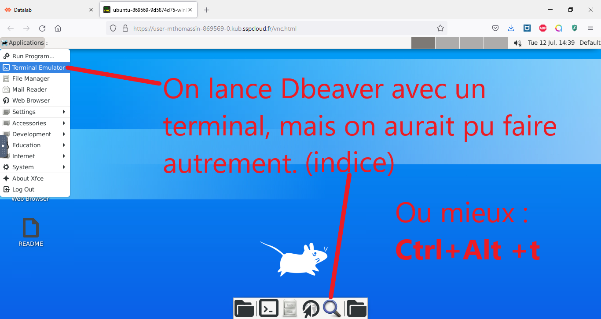

# Tuto : J'apprends à connecter ma base Postgresql à mon Dbeaver ! 


Dans ce tuto, j'apprends à travailler sur une base Postgresql à partir du logiciel DBeaver, au sein de la plateforme [Onyxia](https://datalab.sspcloud.fr). (pour une présentation d'Onyxia et la façon de s'y connecter, voir [ici](https://www.example.com))

## **DBeaver** : Qu'est-ce que c'est ?

Les plus anglophones d'entre nous auront peut-être été [surpris](https://github.com/dbeaver/dbeaver/discussions/11422#discussioncomment-743232) par le nom de ce logiciel. :wink: 


**DBeaver** est un logiciel permettant de **gérer plusieurs bases de données différentes** sur une seule et même application, et donc de **manipuler des données de différentes sources très rapidement**. Par exemple, dans le cadre de l'Ensai, autant de bases de données que de TP de SQL, ou dans le cadre de l'Insee une base pour le développement, une base pour la production (! attention fragile !) et une base "bac à sable".

Et pour **Postgresql** : [ici](https://wiki.postgresql.org/wiki/Logo), on apprend l'origine du logo de Postgresql (mais surtout le nom de l'éléphant! :heart_eyes:) 

## Je crée d'abord ma base Postgresql (passer à l'étape suivante si déjà connu)

On lance donc d'abord un service **Postgresql**.  (Rappel: on utilise  [Onyxia](https://datalab.sspcloud.fr))


On arrive sur la page de création d'un service Postgresql: 


Pour utiliser ma base Postgres, je veux utiliser **DBeaver**. Ce logiciel est préinstallé sur le service Ubuntu. Vous l'aurez donc deviné, je vais lancer un service **Ubuntu**

## Je lance ensuite mon service Ubuntu

[**Ubuntu**](https://en.wikipedia.org/wiki/Ubuntu_philosophy), c'est d'abord une philosophie, c'est le monde du libre (:penguin:) et ça veut dire "humanité". On le traduit parfois par "Je suis parce que tu es" et cela représente une philosophie humaniste, qui cherche à relier "soi, les autres, le monde". En plus, c'est juste indispensable de s'y mettre car tous les serveurs fonctionnent aujourd'hui avec un noyau linux. :smiling_imp: C'est donc l'occasion de s'y mettre à tout petit pas.

### J'ouvre un service Ubuntu


J'obtiens un Ubuntu ! Victoire ! :balloon: :penguin: :balloon:


## Et finalement je lance et connecte DBeaver à ma base Postgresql

### On va ouvrir un terminal, parce que quand j'utilise les lignes de commande je me sens l'âme d'un hacker (et surtout je n'ai pas besoin de bouger la main)



Dans mon terminal, je lance la commande de DBeaver :
```
dbeaver
``` 


### On va pouvoir relier DBeaver à notre base postgresql


### Youpi ! J'ai de quoi me connecter. Mais comment ça marche ?


## Maintenant c'est un jeu de "quoi va où" 

### On récupère les informations nécessaires sur la page "**Mes services**" du Datalab


### On a besoin de 5 informations

- le **port** :Postgresql écoute par défaut le port **5432**. C'est celui qui est configuré par défaut au lancement du service Postgresql.
- **host** : c'est l'hôte, qui est renseigné avant le port dans le readme du service postgresql. Il est de la forme postgresql-xxxxxxxx
- le **username** : idem, de la forme user-mon_nom_sur_onyxia
-  **database** : le nom de la base, defaultdb par défaut
- le **password** : celui de l'utilisateur et de l'administrateur sont les mêmes au lancement du service postgresql.

Une petite image pour visualiser :


### Pour copier-coller le mots de passe et le nom de l'host, il vaut mieux utiliser le presse-papier entre ma fenêtre Datalab et celle du Ubuntu.


### Je copie-colle chaque information que je ne veux pas reprendre à la main dans le presse-papier : le nom de l'host et le mot de passe par exemple.


Ce qui donne :


### Je clique sur **Finish** en bas à droite et je peux utiliser ma base


### Et quand j'ai fini de travailler :


# :blush: