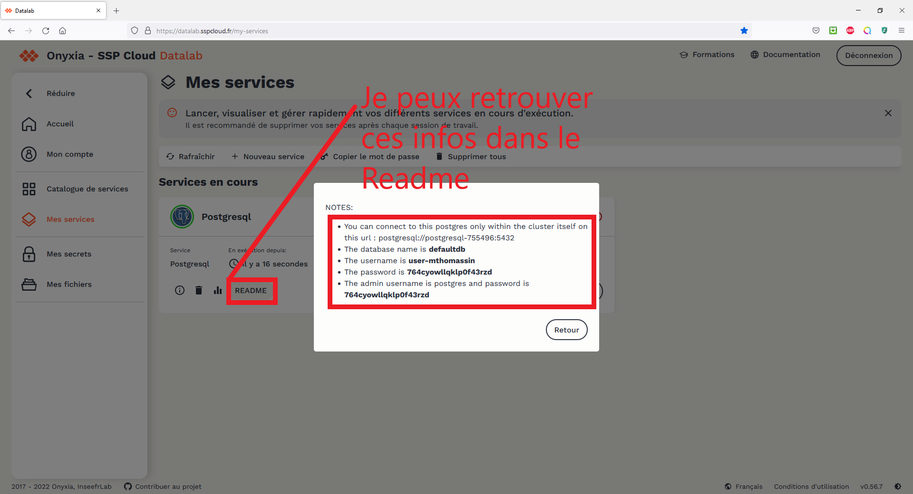

# Tuto : J'apprends à connecter ma base Postgresql à mon Dbeaver ! 

Dans ce tuto, j'apprends à travailler sur une base Postgresql à partir du logiciel DBeaver, au sein de la plateforme [Onyxia](https://datalab.sspcloud.fr). (pour une présentation d'Onyxia et la façon de s'y connecter, voir [ici](https://www.example.com))

## **DBeaver** : Qu'est-ce que c'est ?

Les plus anglophones d'entre nous auront peut-être été [surpris](https://github.com/dbeaver/dbeaver/discussions/11422#discussioncomment-743232) par le nom de ce logiciel. :wink: 

**DBeaver** est un logiciel permettant de **gérer plusieurs bases de données différentes** sur une seule et même application, et donc de **manipuler des données de différentes sources très rapidement**. Par exemple, dans le cadre de l'Ensai, autant de bases de donnée que de TP de SQL, ou dans le cadre de l'Insee une base pour le développement, une base pour la production (! attention fragile !) et une base "bac à sable".

Et pour **Postgresql** : où l'on apprend l'origine du logo de Postgresql (mais surtout le nom de l'éléphant! :heart_eyes:) https://wiki.postgresql.org/wiki/Logo

## Je crée ma base Postgresql (passer à l'étape suivante si déjà connu)

On lance donc d'abord un service **Postgresql**. 

On arrive sur la page de création d'un service Postgresql: 

Pour utiliser ma base Postgres, je veux utiliser **DBeaver**. Ce logiciel est préinstallé sur le service Ubuntu. Vous l'aurez donc deviné, je vais lancer un service **Ubuntu**

## Je lance mon service Ubuntu

[**Ubuntu**](https://en.wikipedia.org/wiki/Ubuntu_philosophy), c'est d'abord une philosophie, c'est le monde du libre (:penguin:) et ça veut dire "humanité". On traduit parfois "Je suis parce que tu es" et cela représente une philosophie humaniste, qui cherche à relier "soi, les autres, le monde". En plus, c'est juste indispensable de s'y mettre car tous les serveurs fonctionnent aujourd'hui avec un noyau linux.

## Je lance et connecte DBeaver à ma base Postgresql