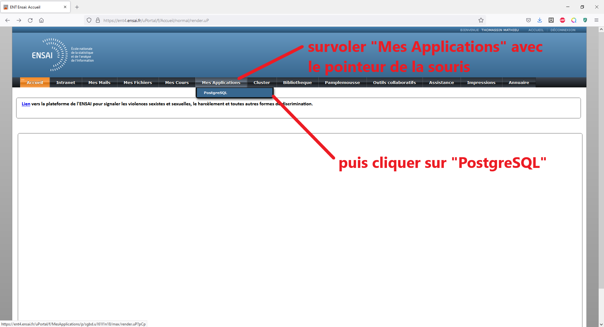

# Tuto : J'apprends à réviser mon TP de Base de Données à la maison :sweat_smile:

Aujourd'hui, c'était TP de SQL. J'ai fait des super requêtes, mais maintenant, je voudrais bien réviser un peu depuis chez moi. Voyons voyons... Comment c'était déjà ? 
D'abord, aller sur l'**E**space **N**umérique de **T**ravail de l'école. Mince, j'ai oublié le lien !

Repartons du site de l'Ensai: https://ensai.fr/ . Il suffit de cliquer sur **ENT**, en haut à droite de la page d'accueil. 

J'arrive sur l'ENT :

Puis sur le service d'authentification. J'y rentre mon identifiant et mon mot de passe (:zipper_mouth_face:). 

Et j'arrive sur la page d'accueil de mon espace personnel. 

Normalement, je devrais pouvoir retrouver de quoi travailler mon TP bientôt... 

Malheur ! L'application est disponible uniquement en se connectant depuis l'Ensai. Faudra-t-il que je révise mes TP à l'école ?  Mais moi j'aime l'odeur du SQL au petit matin, le son de Postgres le soir au fond des bois. Et puis, j'ai vraiment besoin de valider l'UE. :sob:

# Heureusement, le Datalab est là ! :partying_face:

Disposant d'un compte Ensai/Ensae, je peux utiliser le Datalab fourni par la division Innovation de l'Insee : https://datalab.sspcloud.fr/home, 

et ceci que je sois en cursus ingénieur ou fonctionnaire ! 

