# Tuto : J'apprends à utiliser Vscode sur le Datalab en sauvegardant mon code sur Github
**OBJECTIF** Obtenir un environnement de développement standard (Vscode + python) pour les TP d'algorithmique, de programmation orientée objet et de projet informatique en 1A. 

## Je lance un service Vscode

### Je me rends sur le Datalab => https://datalab.sspcloud.fr/home et j'arrive sur cette page :
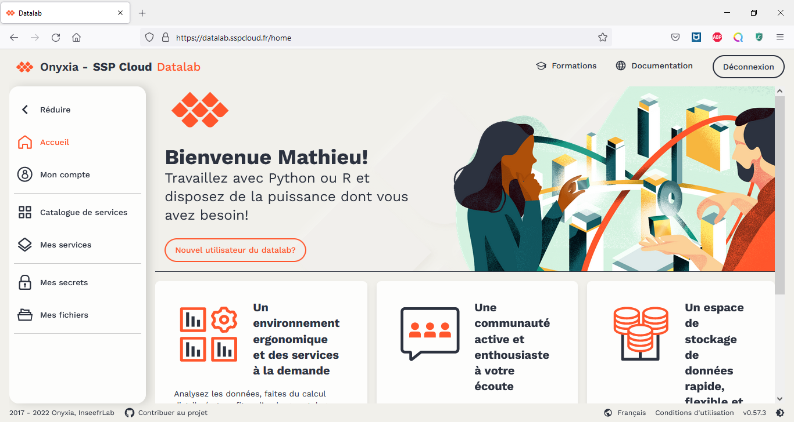

Je sélectionne "Catalogue de services" et je cherche Vscode :

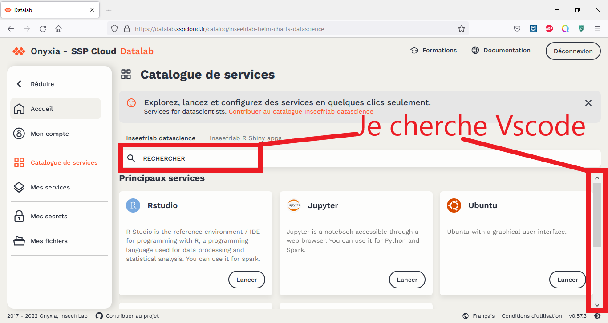

### Je lance un VsCode
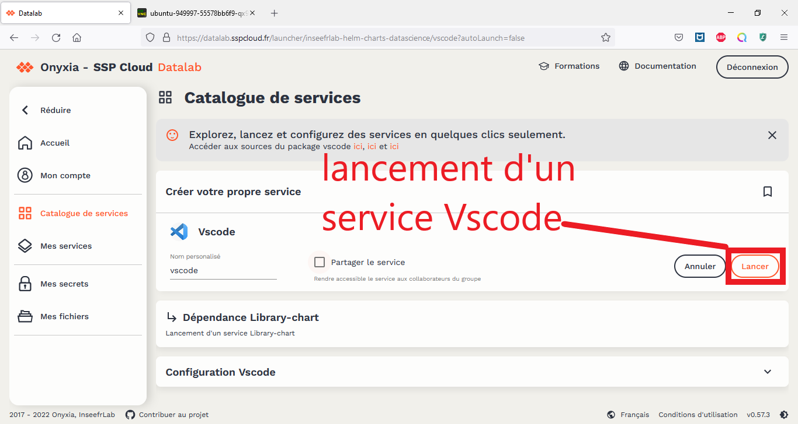

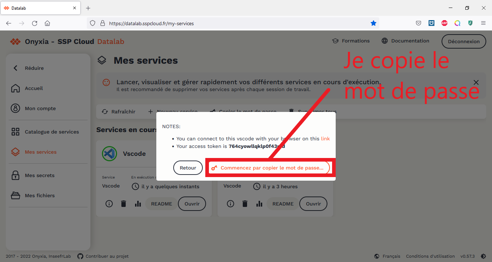

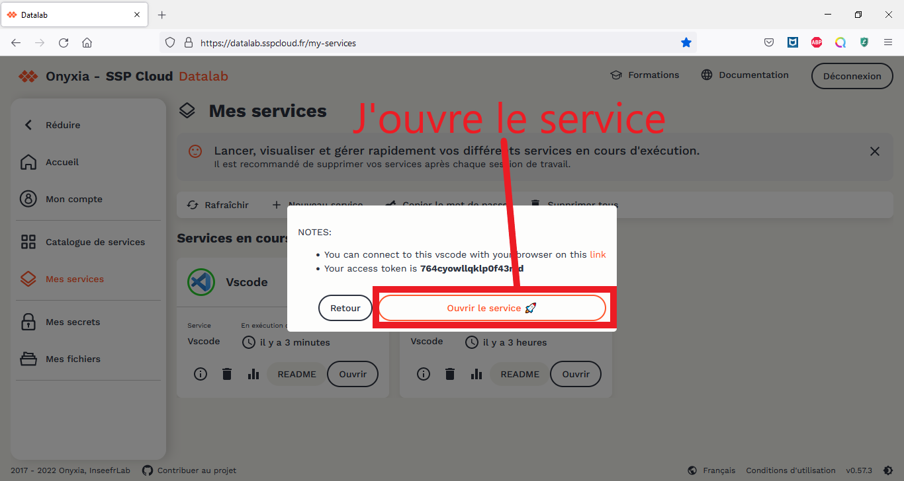

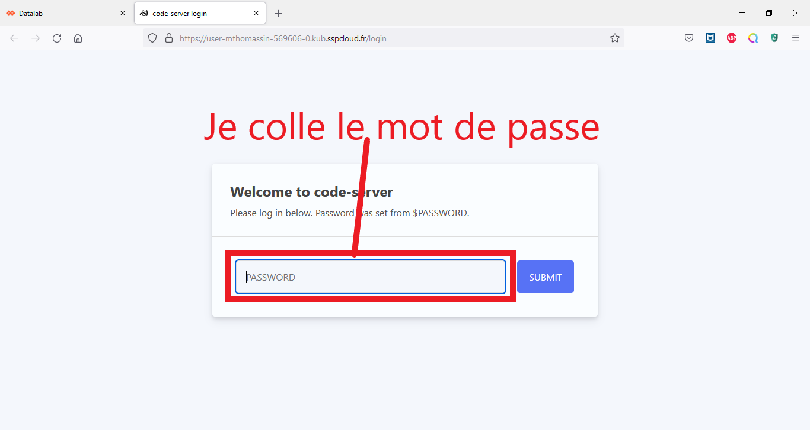

Et voilà le travail  ! Un beau Vscode tout neuf (avec python). 

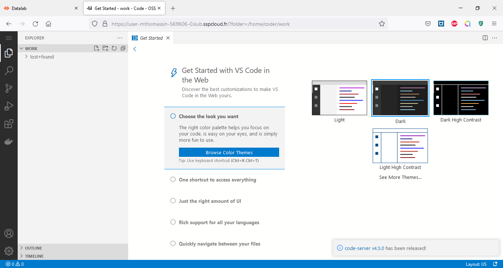

Mais, Onyxia fonctionne avec la technologie des conteneurs, ce qui pour nous signifie qu'on ne peut pas enregistrer de données dans notre Vscode. Nous allons donc faire comme font tous les informaticiens : **découpler le code des données**. Et pour cela, nous allons utiliser **GitHub**. 

## Je clone mon projet github sur mon Vscode

### Je me rends sur mon compte Github

=> https://github.com/
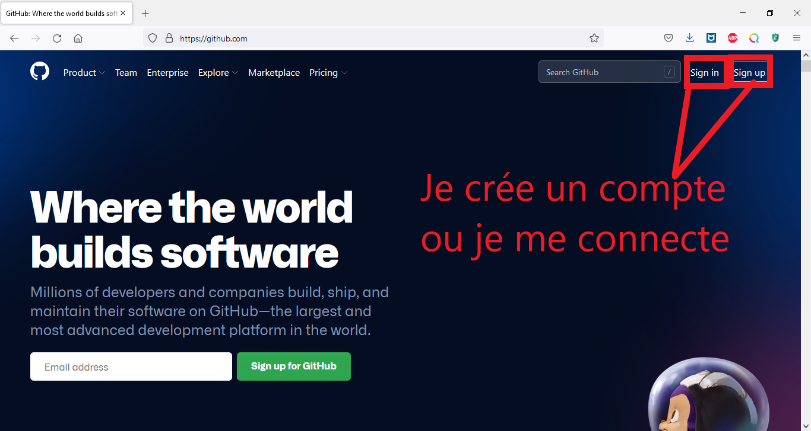

### Je crée un nouveau repository 

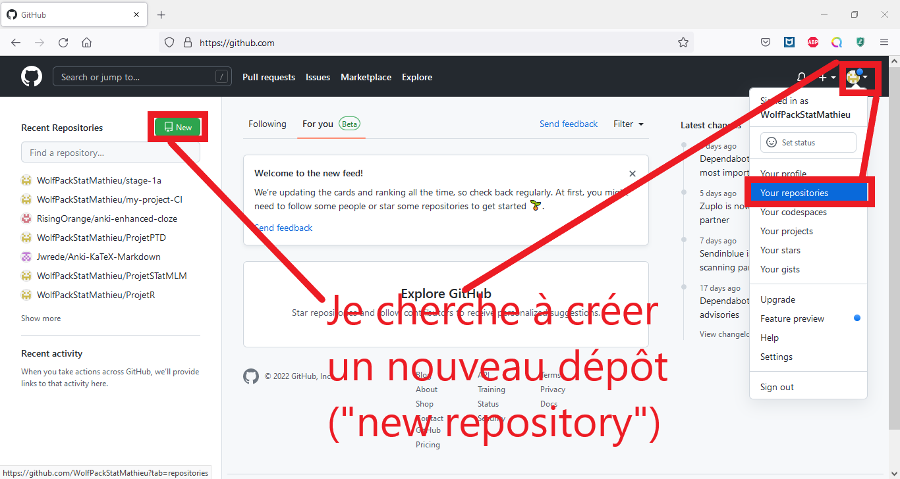
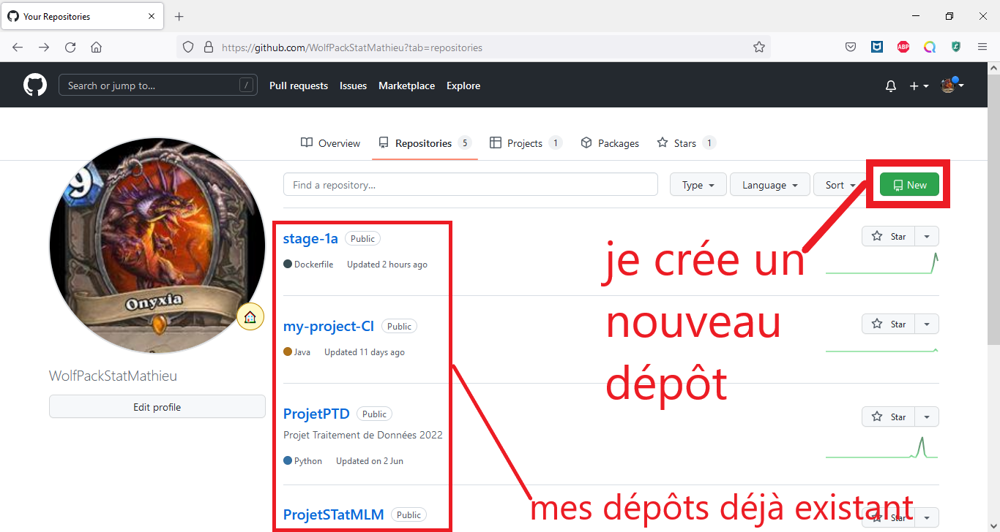

Je donne un nom à mon dépôt, par exemple "depot_de_toto"
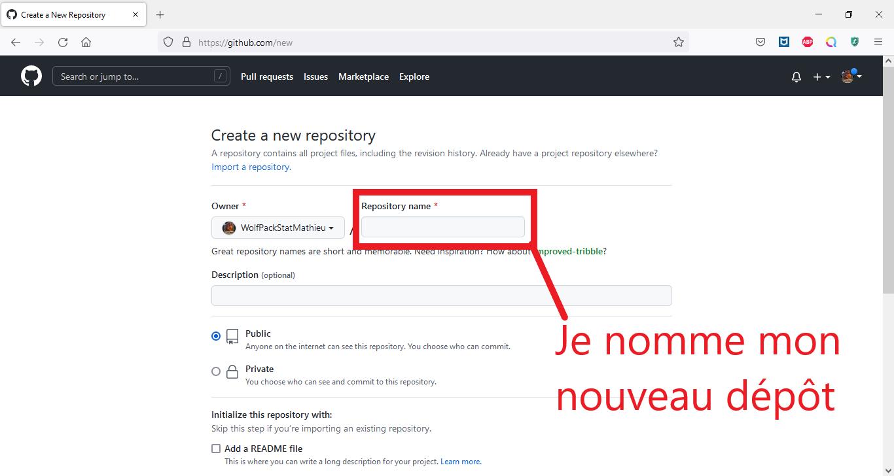

Pour le moment, je ne modifie pas les options, et je déroule la page pour cliquer sur "create repository".

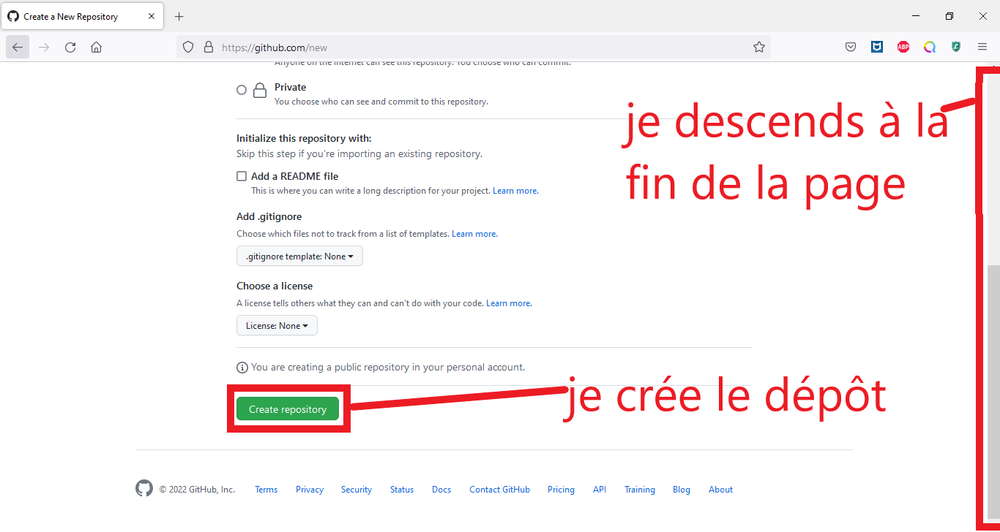

Voilà, j'ai un beau repository tout neuf sur mon compte GitHub. Mais moi, je veux pouvoir travailler dessus à partir de Vscode.

Pour pouvoir faire ça, je vais cloner ce dépôt sur mon poste local, puis je synchroniserai les modifications du code entre mon poste local et mon dépôt GitHub.

## Je clone mon projet sur Vscode avec un token personnel 

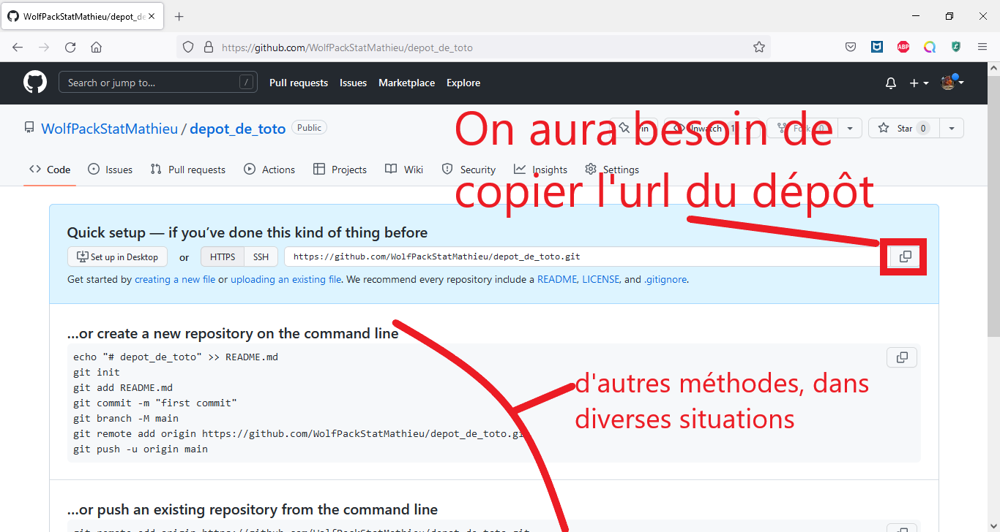

### Je génère un token (="jeton mot de passe") qui me permettra d'accéder à mon compte GitHub depuis un terminal :

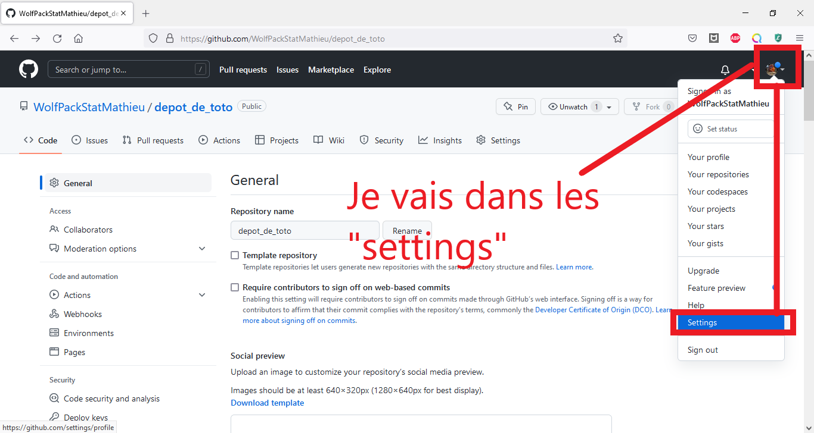

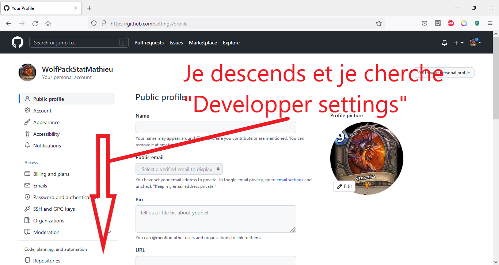

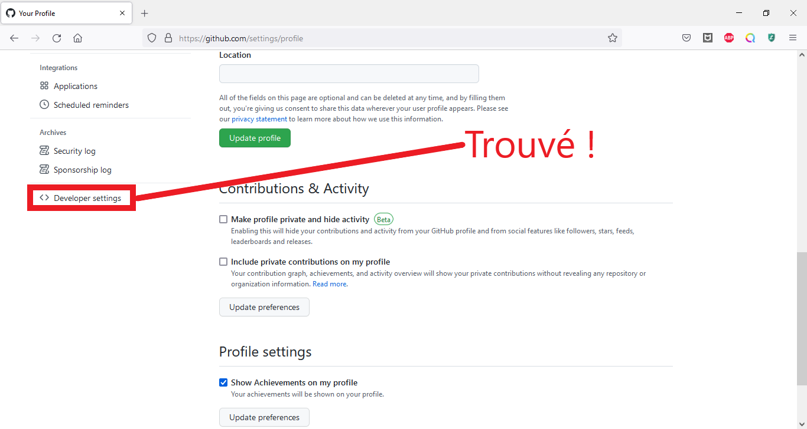

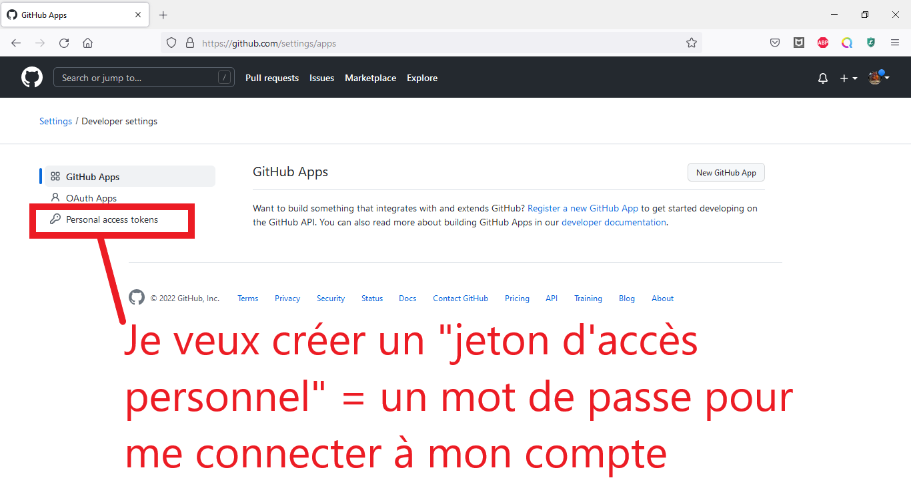

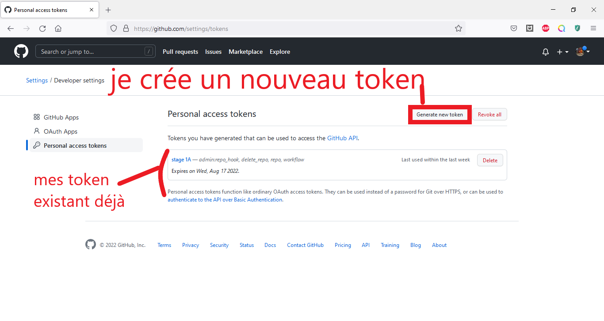

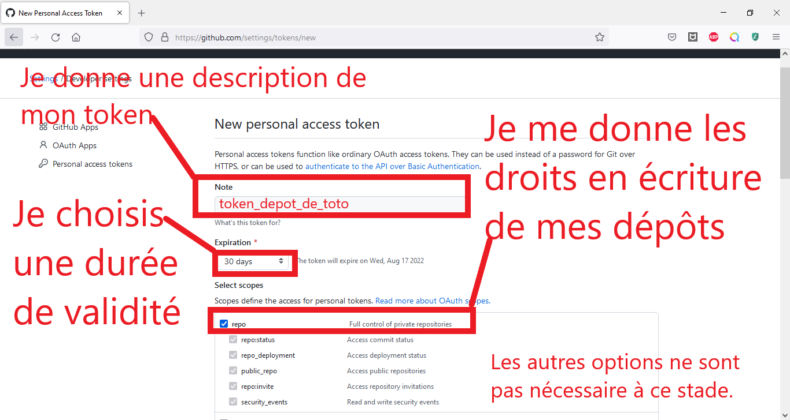

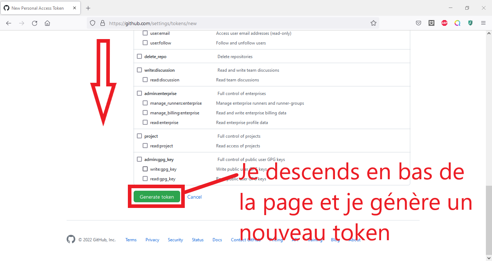

Je vais dans Vscode, et j'ouvre un terminal.

# Je relance un Vscode, mais avec ma configuration git personnelle

# Je m'entraîne à manipuler Git avec un super tuto déjà existant

[une présentation Git](https://hackmd.io/AOSXJAJiR4q7GKdbiKcKsw)
et le [tuto](https://hackmd.io/BdGZF6qOTk2qvzAlvrz_WA) qui va avec. Pour ces tutos, il faudra créer un compte sur Gitlab $\neq$ Github. Mais les deux permettent d'utiliser Git. Il faudra donc modifier vos paramètres d'utilisateurs.